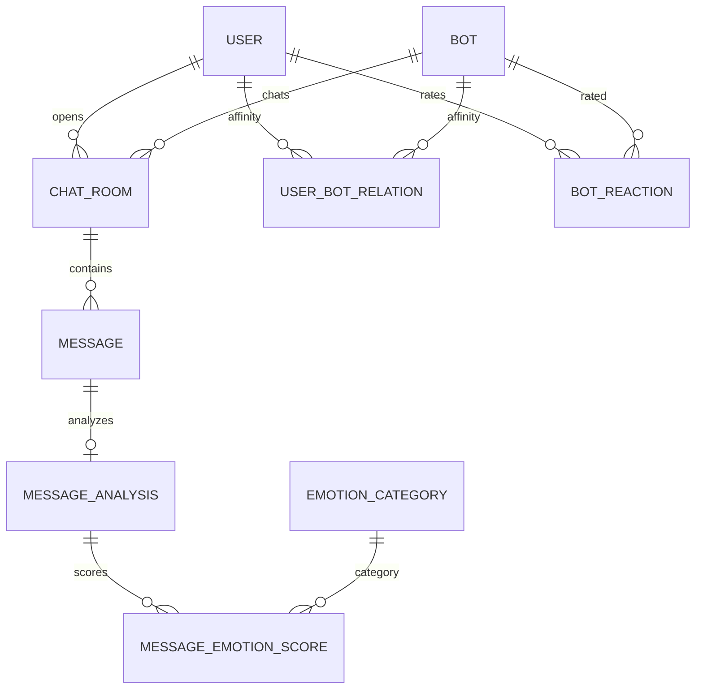

# Matey DB 설계서 (기획서 · DB 초안 연동본)

**기준 문서**: `기획서.txt`, `DB 초안.sql`  
이 문서는 **기획 기능을 어떤 테이블로 구현하는지**, **`DB 초안.sql`에 이미 있는 것·추가·수정할 것**을 한곳에 정리한다.

---

## 1. 기획 기능 ↔ 테이블 매핑

| 기획 영역 (기획서) | 구현 방향 | 주요 테이블 (초안 기준) |
|-------------------|-----------|-------------------------|
| 이메일 가입·로그인 | 로컬 계정 | `USER` |
| 소셜 로그인 (Naver/Kakao) | 제공자 연동 | `SOCIAL_LOGIN` |
| 반자동 로그인 | 장치별 토큰 | `AUTO_LOGIN` |
| 비밀번호 재설정 | 토큰 발급 | `PASSWORD_RESET_TOKEN` + 재설정 시 `AUTO_LOGIN` 등 세션 무효화(정책) |
| 동일 이메일 유도 | 서비스 규칙 | `USER.email` UNIQUE + 가입 플로우(별도 테이블 필수는 아님) |
| 멀티턴 채팅·문맥 | 메시지 시퀀스 | `CHAT_ROOM`, `MESSAGE` |
| 팝업형 채팅 UI | 프론트 | DB 무관 |
| 메시지 좋아요/싫어요 | 메시지 단위 피드백 | `COUNSEL_FEEDBACK` (타입·마스터 정리 권장, 아래 §5) |
| 채팅방 목록 | 방 상태·정렬 | `CHAT_ROOM` (`last_message_at`, `status`) |
| 3시간 미작동 아카이브 | 배치·타임스탬프 | `CHAT_ROOM.last_message_at`, `archived_at`, `status` |
| 대화 요약 | 요약 본문 저장 | `COUNSEL_SUMMARY` (**스키마 재설계 필요**, §4) |
| 만족도 팝업 | 세션 단위 평가 | `SATISFACTION` |
| 감정 분석·저장 | 메시지 분석 | `MESSAGE_ANALYSIS`, `EMOTION_CATEGORY`, `MESSAGE_EMOTION_SCORE` |
| 위험도 1~5 | 분석 결과 | `MESSAGE_ANALYSIS.risk_level`, `is_high_risk` |
| 샘플 대화 기반 봇 선택 | 봇 메타 | `BOT.selection_preview`, `prompt_text` 등 |
| 봇 인기 랭킹·월/연 집계 | 스냅샷·집계 | `BOT_POPULARITY_STAT`, (`BOT.like_count`/`dislike_count` 캐시) |
| 좋아요/싫어요 기반 인기 | 반응·집계 | `BOT_REACTION`, 집계 배치 → `BOT_POPULARITY_STAT` |
| 일일 출석·만능사료·먹이·친밀도 | 재화·관계 | `USER_ACTIVITY_DAILY`, `FEED_TRANSACTION`, `USER_INVENTORY`, `USER_BOT_RELATION` |
| 친밀도에 따른 모션/배경 해금 | 해금 조건 | `BOT_MOTION`, `CHAT_BACKGROUND` (`unlock_intimacy_level`) |
| 공통/종별 모션 | 리소스 그룹 | `BOT_MOTION.motion_group` (종별·공통 구분) |
| 오랜만 접속·자정·위험3+·감정개선 쪽지 | 이벤트 쪽지 | `BOT_LETTER` (`letter_type`) |
| 상담 기록·감정 리포트 | 조회·집계 | `CHAT_ROOM`+`MESSAGE`+`MESSAGE_ANALYSIS` (리포트는 뷰/배치 가능) |
| 설정·알림 | 사용자 설정 | `USER_SETTING`, `USER_NOTIFICATION_SETTING`, `NOTIFICATION`, `NOTIFICATION_TYPE` |
| 관리자: 감정·위험 통계 | 집계 | 분석 테이블 기반 뷰/리포트 테이블 |
| 관리자: 봇 인기 | 집계 결과 | `BOT_POPULARITY_STAT` |
| 관리자: 피드백·만족도 | 만족도·문의 | `SATISFACTION`, `SUPPORT` |
| 공지·FAQ | 콘텐츠 | `ADMIN_NOTICE`, `ADMIN_FAQ` |
| 커뮤니티 고민글·사람 답변 | 일반 커뮤니티와 유사한 흐름 | `POST`, `COMMENT`, `CATEGORY` |
| QNA/FAQ 작성 권한 | 사용자는 작성 불가, 관리자 작성 | `ADMIN_FAQ`, `SUPPORT` 집계 기반 운영 |
| 커뮤니티(게시글·댓글) | 선택 기능 | `POST`, `COMMENT`, `CATEGORY` |

### 1.1 채팅·메시지 UX 방향 — 카카오톡 유사, **모바일 전용 기능 제외**

**방향**: 채팅방·메시지는 **카카오톡처럼 익숙한 메신저 동선**(목록 → 방 진입 → 위에서 아래로 흐르는 말풍선·시간·스크롤)을 목표로 하되, **스마트폰 앱에 묶인 기능만 빼고** 웹·데스크톱에서 동일한 패턴으로 구현한다.

**포함(카톡과 비슷하게 가져올 것)**

| 영역 | 내용 |
|------|------|
| 채팅 목록 | 사용자 기준 **방 목록**, 정렬은 **최근 메시지 시각** 우선. **마지막 한 줄 미리보기**, 상대(봇) 이름·아바타. |
| 대화 화면 | **사용자 / 상대(봇) 말풍선 구분**, 타임스탬프, 길어지면 **위로 스크롤 + 페이지네이션**(§10). 기획의 **팝업형 UI**는 카톡의 “채팅창 오버레이”에 가깝게 두어도 됨. |
| 화면 배치 | **채팅방 진입 시 좌/우 2영역**: 한쪽은 **봇 영역(아바타·모션)**, 다른 한쪽은 **채팅 영역(메시지 목록·입력창)**. |
| 방 관리 | 방 **나가기·숨김·삭제**(소프트 삭제·연말 퍼지는 기존 §2.1과 동일). 방 제목 편집(선택). |
| 읽음·알림 | **안 읽은 개수 배지**가 필요하면 `last_read_message_id` 또는 `last_read_at`을 **`CHAT_ROOM` 또는 사용자별 읽음 테이블**에 둔다(1인 1봇 방이면 `CHAT_ROOM`에 컬럼으로도 충분). **인앱 알림·이메일**은 유지 가능. |
| 입력·부가 | 텍스트 중심; 이미지·파일은 **웹 업로드**로 확장 시 `MESSAGE`에 첨부 메타/스토리지 URL. **답장(인용)**·이모지는 `metadata` 또는 별도 컬럼으로 확장. |

**제외·약화(모바일 앱 중심 카톡 기능 — 이 서비스에서는 하지 않거나 후순위)**

| 구분 | 예시 |
|------|------|
| 네이티브 전용 | 푸시를 **알림의 유일한 채널**으로 두지 않음(웹이면 브라우저 알림은 선택). **전화번호·주소록 기반 친구** 없음. |
| 실시간 통화 | **음성·영상 통화**, 라이브 위치 공유 등은 제외. |
| 오픈채팅·대규모 그룹 | **오픈 채팅방**, 수백 명 그룹 채팅은 비목표(본 서비스는 **1:1 사용자–봇**이 기본). |
| 모바일 퍼스트 UI | 하단 탭·제스처만 전제로 한 UX는 제외하고, **가로·세로 창** 모두 쓸 수 있는 레이아웃. |

**DB 요약**: 이미 정한 **`CHAT_ROOM` + `MESSAGE` 1행 1메시지** 모델이 카톡형 목록·대화와 맞다. 추가로 손볼 만한 것은 **`last_message_preview`/`last_message_at`**, **`unread_count` 또는 읽음 커서**, (선택) **`pinned_at`** 정도이며, 나머지는 **API·실시간(WebSocket/SSE)만**으로도 카톡과 비슷한 체감을 낼 수 있다.

---

## 2. `DB 초안.sql` 테이블 목록 (현재)

아래는 **이미 정의된 엔터티**이다. 이름 그대로 DDL을 따른다.

**계정·인증**: `USER`, `SOCIAL_LOGIN`, `AUTO_LOGIN`, `PASSWORD_RESET_TOKEN`, `ROLE`, `USER_ROLE`  

**봇·상호작용**: `BOT`, `USER_BOT_RELATION`, `BOT_MOTION`, `BOT_REACTION`, `CHAT_BACKGROUND`, `BOT_LETTER`, `USER_INVENTORY`, `FEED_TRANSACTION`  

**채팅·분석**: `CHAT_ROOM`, `MESSAGE`, `MESSAGE_ANALYSIS`, `EMOTION_CATEGORY`, `MESSAGE_EMOTION_SCORE`, `COUNSEL_FEEDBACK`, `COUNSEL_SUMMARY`, `SATISFACTION`  

**인기·통계**: `BOT_POPULARITY_STAT`  

**알림·설정**: `NOTIFICATION_TYPE`, `NOTIFICATION`, `USER_NOTIFICATION_SETTING`, `USER_SETTING`  

**고객지원**: `SUPPORT`, `SUPPORT_REASON`, `SUPPORT_ANSWER`  

**커뮤니티**: `POST`, `POST_IMAGE`, `COMMENT`, `CATEGORY`  

**관리자 콘텐츠**: `ADMIN_NOTICE`, `ADMIN_FAQ`  

**일일 활동**: `USER_ACTIVITY_DAILY`  

---

## 2.1 합의·보완 사항 (워크숍 정리)

아래는 **DB·운영 보완 논의를 반영한 단일 체크리스트**다. §3·§4와 같이 읽는다.

| 주제 | 결정·조치 |
|------|-----------|
| **비밀번호 재설정 · 기기** | 재설정 완료 시 **`AUTO_LOGIN`(및 동일 사용자 세션/리프레시)** 삭제·무효화. 푸시·기기 토큰 테이블이 있으면 동일 정책. |
| **거래 내역** | **거래 타입·사유**는 코드 테이블(`FEED_TRANSACTION_REASON` 등) 또는 정규화된 `transaction_type_id`로 구분 — **로그인 보상 / 구매 / 소비 / 조정** 등. |
| **거래 후 잔액** | **`FEED_TRANSACTION.balance_after`** 유지. **`USER`/`USER_INVENTORY`의 현재 잔액**과 정합성 검증용. |
| **사료 단일·복수** | 비즈니스가 단일이면 `USER_INVENTORY` 단순 유지. 복수 상품이면 **`FEED_PRODUCT`** 마스터 + 수량/거래 내역으로 확장. |
| **사용자–봇 친밀도** | **`USER_BOT_RELATION`**에 점수·레벨. **레벨 기준은 `AFFINITY_LEVEL_CRITERIA`**로 분리. |
| **먹이→친밀도→모션 해금** | 먹이 지급 시 `FEED_TRANSACTION` 기록 + `USER_BOT_RELATION.intimacy_score` 갱신. 해금 조건은 `BOT_MOTION.unlock_intimacy_level`로 판정. |
| **`updated_at`** | **관리자·배치·감사 쿼리에 실제 사용할 때만** 컬럼 유지. 화면에 안 쓰고 쿼리도 없으면 **생략**. |
| **봇 쪽지 타입** | **`BOT_LETTER_TYPE`** 마스터 + `BOT_LETTER.letter_type_id` FK 권장. |
| **상담 봇 메타** | **`species_type` 제거** 방향. **`prompt_text`**, 목록용 **`description_preview`** (및 기존 `selection_preview`). |
| **봇 모션** | **`sort_order`, `is_active` 삭제** 합의 시 DDL에서 제거. |
| **인기 통계** | **`POPULARITY_STAT_CRITERIA`** 기준 테이블 + `BOT_POPULARITY_STAT` 스냅샷. |
| **봇 좋아요** | **(1)** 기존 **`BOT_REACTION`**만 쓰고 `LIKE`/`DISLIKE` + `UNIQUE(user_id, bot_id)` 정책 **또는 (2)** 의미 분리를 위해 **`BOT_LIKE`** 전용 테이블 신설. **둘 다 두면 중복이므로 하나만.** |
| **채팅방 제목** | **`title` 기본값** — 서버 생성 시 봇 이름 기반 또는 DDL `DEFAULT`. |
| **삭제·연말 알림·보관** | 사용자 삭제 → **소프트 삭제** + **`scheduled_purge_at`**. UI에 **연말(또는 정책 일자) 완전 삭제 안내**. 보관 만료는 동일 필드로 표현. |
| **상담 요약** | **`bot_id`**, **`anchor_message_id`(마지막 기준 메시지)** FK. 필요 시 `chat_room_id` 포함. |
| **상담 만족도** | **방 단위** `SATISFACTION`은 **`CHAT_ROOM` 삭제 시 함께 삭제**(CASCADE 또는 정책 삭제). 장기 지표는 **`USER_BOT_SATISFACTION_ROLLUP` (`user_id`, `bot_id`만)** 등 별도 집계 테이블. |
| **메시지 본문** | 대화 전체를 **한 행 JSON에 누적하지 않음**. **메시지 1건 = 1행**. 부가 메타만 **`metadata` JSON** 허용. |
| **로컬(PC) 저장** | **서버 DB가 진실 원본**(기기 간 동기·분석·관리자 대응). 클라이언트 로컬은 **임시 캐시·오프라인 초안** 정도만. |
| **메시지 양·분석** | **전량 즉시 분석** vs **일 단위 배치**는 비용 정책. 배치 시 **`analyzed_at`/워터마크**로 범위 관리. 원문 보존 기간과 분석 결과 보존 기간 분리 정의. |
| **상담평가 vs 만족도** | **역할 통합**: 세션 종료 **만족도는 `SATISFACTION` 한 곳**. 메시지 단위는 **`COUNSEL_FEEDBACK`**만. 동일 의미 테이블 이중 금지. |
| **반응 타입** | 확장·관리 용이하게 **`REACTION_TYPE` 마스터 + FK** (`COUNSEL_FEEDBACK`, `BOT_REACTION` 등). |
| **문의·신고** | 유형은 **`classification`/`category_code` 컬럼** + 필요 시 **`INQUIRY_CLASSIFICATION`**, **`REPORT_CLASSIFICATION`** 참조 테이블. |
| **신고/문의 답변 주체** | 사용자가 `SUPPORT` 작성 → 관리자가 `SUPPORT_ANSWER`로 답변. |
| **알림 코드** | `NOTIFICATION_TYPE` 폐기 시 **`is_active` 또는 `deleted_at`**. |
| **사용자 알림** | **`updated_at` 없음** — 생성·읽음 시각 중심. |
| **일일 활동** | 출석·보상은 **`FEED_TRANSACTION`으로 추적 가능하면** `USER_ACTIVITY_DAILY`의 **활동점수·출석 플래그 축소**. **`created_at` 제거** 검토. |
| **설정·활동** | **`USER_SETTING` 등에서 `created_at`/`updated_at`** 미사용이면 **삭제**. |
| **QNA/FAQ 운영 정책** | FAQ/QNA는 사용자가 직접 작성하지 않음. 신고/문의에서 자주 나오는 질문을 관리자가 선별해 `ADMIN_FAQ`로 게시. |
| **권한 계층** | 사용자 -> 중간 관리자 -> 슈퍼관리자. 사용자는 관리자가 될 수 있으나, 슈퍼관리자는 승격 불가(슈퍼관리자만 관리자 임명 가능). |

---

## 3. 신규로 추가하는 것이 좋은 테이블

기획·운영·이전 합의를 반영해, **초안에 없고 추가를 권장**하는 것이다.

| 테이블명 (안) | 목적 | 비고 |
|----------------|------|------|
| **`AFFINITY_LEVEL_CRITERIA`** | 친밀도 레벨 임계값(점수 구간)·버전 관리 | `USER_BOT_RELATION`의 `intimacy_level` 산정 기준 분리 |
| **`POPULARITY_STAT_CRITERIA`** | 월/연 인기 산정 공식·가중치·버전 | `BOT_POPULARITY_STAT` 집계 배치가 참조 |
| **`BOT_LETTER_TYPE`** | 쪽지 타입 마스터 (`RECONNECT`, `MIDNIGHT`, …) | `BOT_LETTER.letter_type`을 FK로 두면 기획의 쪽지 종류 확장 용이 |
| **`FEED_TRANSACTION_REASON`** (또는 `TRANSACTION_TYPE`) | `FEED_TRANSACTION.reason` 정규화 | 로그인 보상 vs 먹이 소비 등 구분 명확화 |
| **`REACTION_TYPE`** | 메시지/봇 반응 코드 통합 또는 분리 시 | `COUNSEL_FEEDBACK`, `BOT_REACTION`의 문자열을 FK로 통일할 때 |
| **`USER_BOT_SATISFACTION_ROLLUP`** (선택) | `user_id`+`bot_id` 단위 만족도 누적 | 채팅방 삭제 후에도 유지할 **집계만** 필요할 때. 세션 단위 `SATISFACTION`과 역할 분리 |
| **`BOT_LIKE`** (선택, §2.1) | 봇 좋아요만 명시적으로 분리 | **`BOT_REACTION`을 쓰지 않을 때** 또는 마이그레이션 전용. **`BOT_REACTION`과 병행하지 않음.** |
| **`ADMIN_ROLE_POLICY`** (선택) | 관리자 권한 범위(FAQ/문의답변/공지/기간정지) 정책 테이블 | 역할별 허용 기능을 코드 없이 관리할 때 |

**봇 좋아요 중복 주의**: 사용자별 봇 “좋아요”는 **`BOT_REACTION`(타입 LIKE)** 로 충분할 수 있다. **`BOT_LIKE`를 추가**하면 조인·집계 경로가 둘로 갈라지므로, **하나를 표준으로 정하고** 다른 쪽은 폐기한다.

---

## 4. 기존 테이블에서 수정·보완할 컬럼 (요약)

### 4.1 `BOT` (기획: 샘플 대화 선택형·프롬프트·미리보기)

- **유지**: `prompt_text`, `selection_preview`(기획의 샘플 대화·선택 UI).
- **이전 합의**: `species_type` **삭제 검토** 시, “종별 모션”은 **`BOT_MOTION.motion_group`**으로 처리 (봇별 리소스면 `bot_id`로 구분).
- **추가 검토**: 목록용 짧은 문구 `description_preview` (긴 `description`과 구분).

### 4.2 `BOT_MOTION`

- **삭제 검토**: `sort_order`, `is_active` (합의 시 제거, 노출은 앱/백엔드 정책).

### 4.3 `CHAT_ROOM`

- **기본 제목**: `title`에 DB `DEFAULT` 또는 생성 시 봇 이름 기반 문자열.
- **사용자 삭제·연말 퍼지**: `user_deleted_at`, `scheduled_purge_at`(또는 `retention_until`) 등 **소프트 삭제 + 예약 삭제** 컬럼.
- **3시간 아카이브**: 기존 `last_message_at`, `archived_at`, `status`로 충분.

### 4.4 `MESSAGE`

- 기획: 멀티턴·분석. **본문을 JSON 단일 컬럼에만 길게 쌓는 것은 비권장** → 사용자 발화는 **1메시지 1행**, 필요 시 `sender_type`, 본문 컬럼(또는 암호화 필드) 구조화.
- `content` JSON + `last_message` TEXT 중복은 **역할 정리** 필요.

### 4.5 `COUNSEL_SUMMARY` (대화 요약)

- 현재 초안은 PK·의미가 **`MESSAGE_ANALYSIS`와 혼동**될 수 있음.
- 기획 “대화 요약”에 맞게 **`summary_id` PK**, **`chat_room_id`**, **`bot_id`**, **`anchor_message_id`**, **`summary_text`**, **`updated_at`(선택)** 등으로 **재정의** 권장.

### 4.6 `FEED_TRANSACTION`

- 이미 **`balance_after`** 존재.
- **`transaction_type`/`reason`** 을 코드 테이블과 맞추면 기획의 출석·먹이·보상 추적이 명확해짐.

### 4.7 `USER_ACTIVITY_DAILY` (출석·일일 활동)

- 출석·보상은 **`FEED_TRANSACTION`**으로 재현 가능하면 **컬럼 축소** 검토 (`activity_score`, `attendance_rewarded` 등).
- 불필요 시 **`created_at` 제거** 등 단순화.

### 4.8 `USER_SETTING`

- 만족도 팝업 스누즈 등 기획 반영됨. **`created_at`/`updated_at`** 실사용 없으면 제거 검토.

### 4.9 `NOTIFICATION_TYPE`

- 코드 폐기 시 **`is_active` 또는 `deleted_at`** (과거 알림 해석용).

### 4.10 `NOTIFICATION`

- **`updated_at`** 없음 → 유지. (사용자 알림은 생성 시각 중심.)

### 4.11 비밀번호 재설정과 기기

- 재설정 완료 시 **`AUTO_LOGIN` 해당 사용자 행 삭제·무효화** 등 **정책을 애플리케이션에 명시**.

---

## 5. 감정 분석 서브도메인 (유지 권장)

메시지 1건당 분석 0~1건, 감정별 점수 N행.

- **`EMOTION_CATEGORY`**: 감정 마스터.
- **`MESSAGE_ANALYSIS`**: `message_id` UNIQUE, `dominant_emotion_id`, `risk_level`(1~5), `is_high_risk`, 모델 메타 등.
- **`MESSAGE_EMOTION_SCORE`**: `(analysis_id, emotion_id)` UNIQUE.

관계: `MESSAGE` (1) — (0..1) `MESSAGE_ANALYSIS` — (N) `MESSAGE_EMOTION_SCORE`.

---

## 6. 상담 평가·만족도·메시지 반응 (역할 분리)

| 구분 | 용도 | 테이블 |
|------|------|--------|
| 메시지 단위 좋아요/싫어요 | 기획 “메시지 평가” | `COUNSEL_FEEDBACK` (타입을 `LIKE`/`DISLIKE` 또는 `HELPFUL`/`NOT` 등으로 기획과 통일) |
| 세션 만족도 팝업 | 기획 “만족도” | `SATISFACTION` (`chat_room_id`) |
| 봇 자체 선호 | 인기·랭킹 입력 | `BOT_REACTION` |

**중복 방지**: 관리자 “피드백·만족도 관리”는 `SATISFACTION`+`COUNSEL_FEEDBACK`로 나누어 해석하면 된다. 동일 의미의 테이블을 이중으로 두지 않는다.

---

## 7. 문의·신고 (커뮤니티·고객지원)

- **`SUPPORT` + `SUPPORT_REASON`**: 1:1 문의·처리 상태.
- 게시글/댓글 **신고**는 `SUPPORT`(문의/신고)로 라우팅하고, `SUPPORT_REASON` 분류로 처리한다.
- 흐름: **사용자 문의/신고 등록(`SUPPORT`) -> 관리자 답변(`SUPPORT_ANSWER`) -> 상태 완료(`SUPPORT.status='DONE'`)**.
- FAQ/QNA는 사용자 생성이 아니라, 운영자가 문의 빈도 기반으로 `ADMIN_FAQ`에 등록한다.

---

## 7.1 커뮤니티 운영 원칙

- 일반 커뮤니티는 타 사이트와 유사하게 `POST`/`COMMENT` 중심으로 운영한다.
- 고민글은 사용자가 올리고, 답변은 **사람(다른 사용자 또는 관리자)** 이 직접 작성한다.
- 자동 답변 봇은 커뮤니티 답변 주체가 아니며, 커뮤니티는 사람이 상호작용하는 영역으로 유지한다.

---

## 7.2 관리자 권한 모델 (확정안)

### 역할 정의

| 역할 | 설명 |
|------|------|
| `USER` | 일반 사용자 |
| `ADMIN` (중간 관리자) | 운영 실무 권한 보유 |
| `SUPER_ADMIN` | 최고 권한. 관리자 임명/회수 가능 |

### 권한 범위

| 기능 | USER | ADMIN | SUPER_ADMIN |
|------|------|-------|-------------|
| FAQ 작성/수정 (`ADMIN_FAQ`) | X | O | O |
| 문의·신고 답변 (`SUPPORT_ANSWER`) | X | O | O |
| 공지 작성 (`ADMIN_NOTICE`) | X | O | O |
| 사용자 기간 정지 (`USER.status`) | X | O | O |
| 관리자 임명/해제 | X | X | O |
| 슈퍼관리자 임명 | X | X | O(기존 슈퍼관리자만) |

### DB 반영 포인트

- `ROLE`: `USER`, `ADMIN`, `SUPER_ADMIN` 코드 고정.
- `USER_ROLE`: 사용자-역할 매핑 유지.
- 기간 정지는 `USER.status`로 처리한다.

## 8. 구현 우선순위 제안

1. **채팅·메시지·분석**: `MESSAGE` 구조 정리, `MESSAGE_ANALYSIS` 제약, 위험도(1~5) 운영 규칙.  
2. **대화 요약**: `COUNSEL_SUMMARY` 재정의.  
3. **친밀도·먹이·출석**: `USER_BOT_RELATION`, `FEED_TRANSACTION`, (선택) `AFFINITY_LEVEL_CRITERIA`.  
4. **인기**: `BOT_REACTION` → 배치 → `BOT_POPULARITY_STAT`, (선택) `POPULARITY_STAT_CRITERIA`.  
5. **쪽지**: `BOT_LETTER` + (선택) `BOT_LETTER_TYPE`.  
6. **채팅방 lifecycle**: 기본 제목, 소프트 삭제·연말 퍼지 컬럼.  
7. **관리자**: `ADMIN_FAQ`/`SUPPORT_ANSWER`/`ADMIN_NOTICE` 운영 로직.
8. **보안**: 비밀번호 재설정 시 세션/자동로그인 무효화.

---

## 9. ERD 참고 (핵심만)



---

## 10. 메시지 저장·불러오기 — 이렇게 해도 되는가?

**결론: 네.** 아래를 지키면 **저장(쓰기)과 불러오기(읽기) 모두 일반적이고 운영하기 좋다.**

### 10.1 저장(쓰기)

- 사용자/봇이 메시지를 보낼 때마다 **`MESSAGE`에 INSERT 1행** (채팅방 ID, 발신자 구분, 본문 또는 암호화 필드, `created_at`).
- 목록 미리보기용으로 **`CHAT_ROOM.last_message_at`**(및 필요 시 마지막 메시지 요약 컬럼) 갱신은 **같은 트랜잭션 또는 직후**에 처리.
- 감정 분석은 **비동기 큐**로 `MESSAGE_ANALYSIS` + `MESSAGE_EMOTION_SCORE`에 반영해도 된다(사용자 메시지 기준).

### 10.2 불러오기(읽기)

- 채팅방 진입 시 **`WHERE chat_room_id = ? ORDER BY message_id 또는 created_at`** + **키셋/커서 페이징** (예: `message_id > ? LIMIT 50`). 대화가 길어져도 **인덱스·대역폭**이 안정적이다.
- **JSON으로 과거 전체 대화를 한 덩어리 저장하지 않기 때문에**, “한 봇과 오래 상담”해도 **행 단위로 잘라 읽기**가 가능하다.

### 10.3 로컬(PC) 저장과의 관계

- **서버 DB**: 여러 기기에서 동일 이력, 백업, 관리자·위험도 대응의 **기준 데이터**.
- **브라우저/앱 로컬**: 스크롤 위치, 미전송 초안, 짧은 캐시 정도. **진실 원본은 서버**로 두는 편이 안전하다.

### 10.4 하루치만 쌓은 뒤 분석하는 경우

- **원문**은 정책대로 보관하고, **분석 배치**만 하루 1회여도 된다. 그때 **`MESSAGE` 범위를 스캔**해 `MESSAGE_ANALYSIS`를 채우면 된다.
- “하루치만 DB에 둔다”면 **장기 상담 이력 조회가 불가**해지므로, 기획의 “상담 기록 조회”와 **충돌하면 안 된다**. 보통은 **원문 보존 기간 ≥ 서비스 약관**으로 두고, 분석 주기만 배치로 조절한다.

### 10.5 요약

| 질문 | 권장 |
|------|------|
| 한 행씩 저장하고, 방 단위로 시간순 조회해도 되나? | **예.** 표준 패턴이다. |
| JSON에 대화 전체를 넣는 방식과 비교 | 장기 상담·분석·삭제 단위 모두 **행 단위가 유리**. |
| 불러올 때 느려지나? | **인덱스(`chat_room_id`, `created_at`)** + **페이징**으로 완화. |

---

## 11. 적용용 DDL 스크립트(문서용)

아래 SQL은 **`DB 초안.sql` 파일을 직접 수정하지 않고**, DBA/개발자가 별도 마이그레이션 파일로 적용하기 위한 초안이다.

### 11.1 관리자 권한/제재

```sql
-- ROLE 코드 보강 (이미 있으면 중복 방지 로직으로 대체)
INSERT INTO ROLE (role_code, role_name, description)
VALUES
  ('ADMIN', '중간 관리자', 'FAQ/문의답변/공지/기간정지 가능'),
  ('SUPER_ADMIN', '슈퍼 관리자', '관리자 임명/해제 포함 전체 권한');

-- 사용자 기간 정지 이력
```

### 11.2 채팅방/메시지(카톡형 UX 대응)

```sql
-- 채팅방 메타 보강: 미리보기/읽음/삭제 예약
ALTER TABLE CHAT_ROOM
  ADD COLUMN last_message_preview VARCHAR(255) NULL,
  ADD COLUMN last_read_message_id BIGINT NULL COMMENT '1:1 사용자-봇 기준 읽음 커서',
  ADD COLUMN user_deleted_at TIMESTAMP NULL,
  ADD COLUMN scheduled_purge_at TIMESTAMP NULL;

-- 제목 기본값 (DB 정책 허용 시)
ALTER TABLE CHAT_ROOM
  MODIFY COLUMN title VARCHAR(100) NOT NULL DEFAULT '새 상담';

-- 메시지 확장: 발신자/메타
ALTER TABLE MESSAGE
  ADD COLUMN sender_type VARCHAR(20) NOT NULL DEFAULT 'USER' COMMENT 'USER/BOT/SYSTEM',
  ADD COLUMN metadata JSON NULL;

-- 목록/조회 성능 인덱스
CREATE INDEX idx_chat_room_last_message_at ON CHAT_ROOM(last_message_at);
CREATE INDEX idx_message_room_created ON MESSAGE(chat_room_id, created_at);
CREATE INDEX idx_message_room_id ON MESSAGE(chat_room_id, message_id);
```

### 11.3 먹이 -> 친밀도 -> 모션 해금

```sql
-- 친밀도 레벨 기준 테이블
CREATE TABLE AFFINITY_LEVEL_CRITERIA (
  criteria_id BIGINT NOT NULL AUTO_INCREMENT,
  level_no INT NOT NULL,
  min_score INT NOT NULL,
  max_score INT NOT NULL,
  version_no INT NOT NULL DEFAULT 1,
  is_active BOOLEAN NOT NULL DEFAULT TRUE,
  created_at TIMESTAMP NOT NULL DEFAULT CURRENT_TIMESTAMP,
  PRIMARY KEY (criteria_id)
);

-- 거래 사유 코드 정규화
CREATE TABLE FEED_TRANSACTION_REASON (
  reason_id BIGINT NOT NULL AUTO_INCREMENT,
  reason_code VARCHAR(50) NOT NULL,
  reason_name VARCHAR(100) NOT NULL,
  is_active BOOLEAN NOT NULL DEFAULT TRUE,
  PRIMARY KEY (reason_id),
  UNIQUE KEY uk_feed_tx_reason_code (reason_code)
);

ALTER TABLE FEED_TRANSACTION
  ADD COLUMN reason_id BIGINT NULL COMMENT 'FEED_TRANSACTION_REASON.reason_id';
```

### 11.4 봇 쪽지/인기/반응 타입

```sql
CREATE TABLE BOT_LETTER_TYPE (
  letter_type_id BIGINT NOT NULL AUTO_INCREMENT,
  type_code VARCHAR(30) NOT NULL,
  type_name VARCHAR(100) NOT NULL,
  is_active BOOLEAN NOT NULL DEFAULT TRUE,
  PRIMARY KEY (letter_type_id),
  UNIQUE KEY uk_bot_letter_type_code (type_code)
);

ALTER TABLE BOT_LETTER
  ADD COLUMN letter_type_id BIGINT NULL COMMENT 'BOT_LETTER_TYPE.letter_type_id';

CREATE TABLE POPULARITY_STAT_CRITERIA (
  criteria_id BIGINT NOT NULL AUTO_INCREMENT,
  criteria_name VARCHAR(100) NOT NULL,
  period_type VARCHAR(10) NOT NULL COMMENT 'MONTH/YEAR',
  formula_json JSON NOT NULL,
  version_no INT NOT NULL DEFAULT 1,
  is_active BOOLEAN NOT NULL DEFAULT TRUE,
  created_at TIMESTAMP NOT NULL DEFAULT CURRENT_TIMESTAMP,
  PRIMARY KEY (criteria_id)
);

CREATE TABLE REACTION_TYPE (
  reaction_type_id BIGINT NOT NULL AUTO_INCREMENT,
  domain VARCHAR(30) NOT NULL COMMENT 'COUNSEL/BOT/POST/COMMENT',
  type_code VARCHAR(30) NOT NULL,
  type_name VARCHAR(100) NOT NULL,
  is_active BOOLEAN NOT NULL DEFAULT TRUE,
  PRIMARY KEY (reaction_type_id),
  UNIQUE KEY uk_reaction_domain_code (domain, type_code)
);
```

### 11.5 FAQ/문의 운영

```sql
-- SUPPORT 분류 컬럼 (문의/신고)
ALTER TABLE SUPPORT
  ADD COLUMN classification VARCHAR(30) NULL COMMENT 'INQUIRY/REPORT/ETC';

-- SUPPORT_ANSWER 정합성 보강 (답변자 컬럼)
ALTER TABLE SUPPORT_ANSWER
  ADD COLUMN admin_user_id BIGINT NULL COMMENT 'USER.user_id (관리자)',
  ADD COLUMN updated_at TIMESTAMP NULL DEFAULT CURRENT_TIMESTAMP ON UPDATE CURRENT_TIMESTAMP;
```

### 11.6 선택안: 봇 좋아요 전용 테이블(BOT_REACTION 대체 시만)

```sql
-- BOT_REACTION과 병행하지 말 것 (택1)
CREATE TABLE BOT_LIKE (
  bot_like_id BIGINT NOT NULL AUTO_INCREMENT,
  user_id BIGINT NOT NULL COMMENT 'USER.user_id',
  bot_id BIGINT NOT NULL COMMENT 'BOT.bot_id',
  created_at TIMESTAMP NOT NULL DEFAULT CURRENT_TIMESTAMP,
  PRIMARY KEY (bot_like_id),
  UNIQUE KEY uk_bot_like_user_bot (user_id, bot_id)
);
```

### 11.7 FK 추가 예시(적용 시점에 맞춰 단계적 적용)

```sql
ALTER TABLE BOT_LETTER
  ADD CONSTRAINT fk_bot_letter_type FOREIGN KEY (letter_type_id) REFERENCES BOT_LETTER_TYPE(letter_type_id);

ALTER TABLE FEED_TRANSACTION
  ADD CONSTRAINT fk_feed_tx_reason FOREIGN KEY (reason_id) REFERENCES FEED_TRANSACTION_REASON(reason_id);
```

---

이 문서는 **기획서 기능을 DB로 옮길 때의 지도**이며, 실제 DDL 수정 시 `DB 초안.sql`과 충돌하는 부분은 **§2.1**, §3·§4, §10, §11을 기준으로 반영한다.
