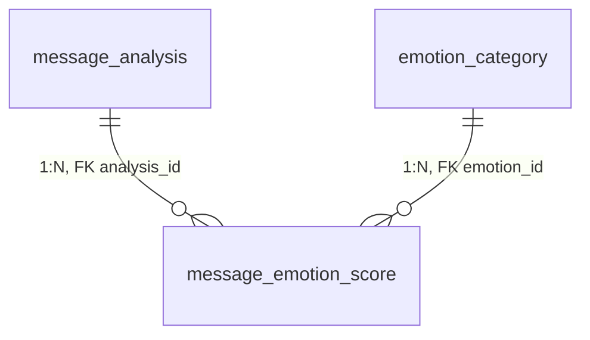
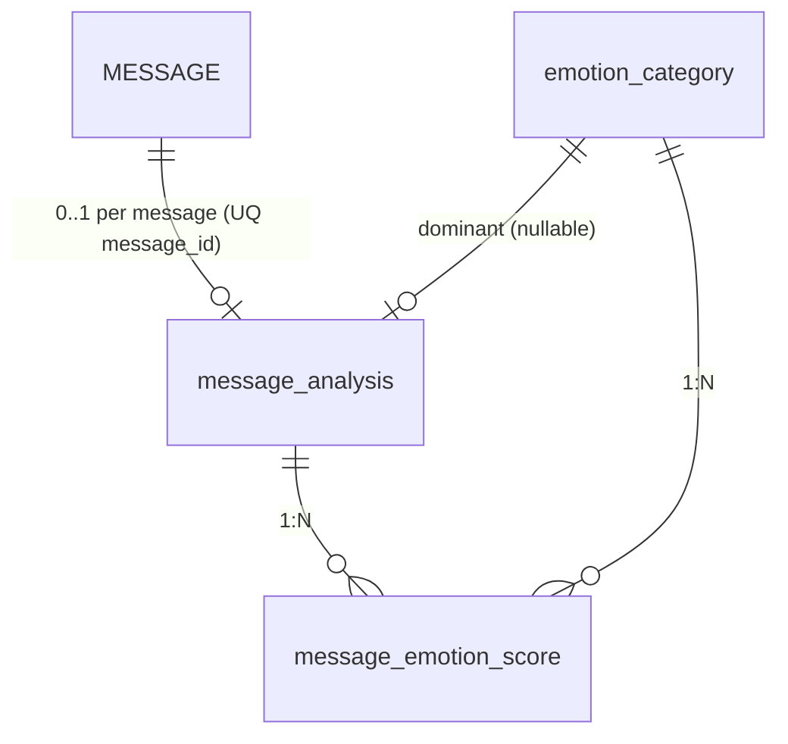
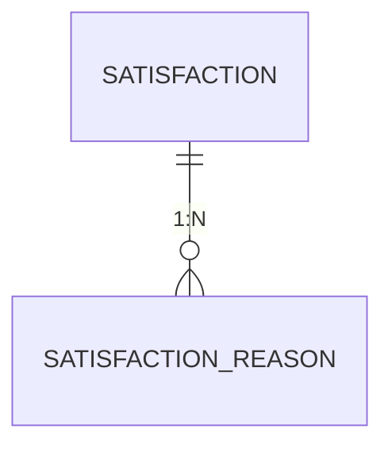
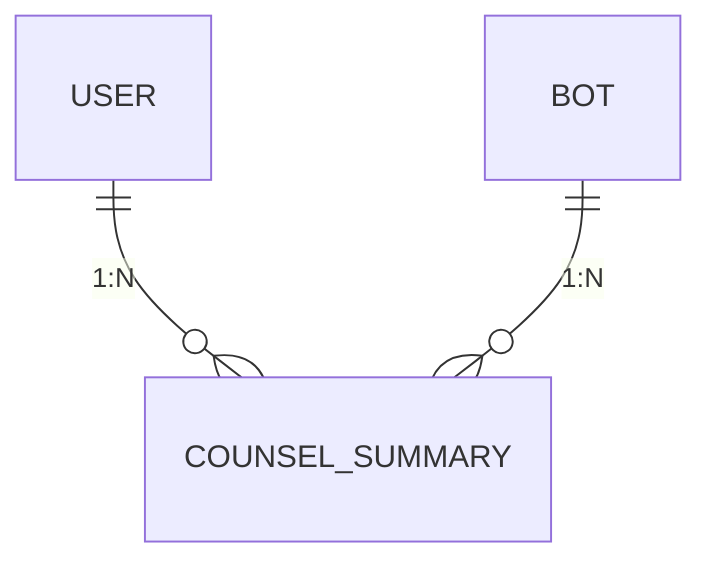

# 상담 메시지 DB 저장 (감정 분석)

## 1. 감정 카테고리 테이블

감정 종류를 하드코딩하지 않기 위한 테이블이다.

```sql
CREATE TABLE emotion_category (
    emotion_id BIGINT AUTO_INCREMENT PRIMARY KEY,
    emotion_code VARCHAR(30) NOT NULL UNIQUE,
    emotion_name VARCHAR(50) NOT NULL,
    is_active BOOLEAN DEFAULT TRUE
);
```

**예시 데이터**

| emotion_id | emotion_code | emotion_name |
|-----------:|--------------|--------------|
| 1 | ANGER | 분노 |
| 2 | SADNESS | 슬픔 |
| 3 | ANXIETY | 불안 |
| 4 | JOY | 기쁨 |
| 5 | NEUTRAL | 중립 |

---

## 2. 메시지 분석 테이블

분석 1건의 대표 결과를 저장한다.

```sql
CREATE TABLE message_analysis (
    analysis_id BIGINT AUTO_INCREMENT PRIMARY KEY,
    message_id BIGINT NOT NULL,

    dominant_emotion_id BIGINT NULL,
    risk_level TINYINT DEFAULT 0,
    is_high_risk BOOLEAN DEFAULT FALSE,

    model_name VARCHAR(100) NULL,
    model_version VARCHAR(50) NULL,

    analyzed_at TIMESTAMP DEFAULT CURRENT_TIMESTAMP,

    UNIQUE (message_id)
);
```

**의미**

| 컬럼 | 설명 |
|------|------|
| `message_id` | 분석 대상 사용자 메시지 |
| `dominant_emotion_id` | 가장 높은 감정 |
| `risk_level` | 위험도 |
| `model_name` | 분석 모델명 |
| `model_version` | 분석 모델 버전 |

---

## 3. 감정별 점수 테이블

`message_emotion_score`는 **한 건의 메시지 분석**(`message_analysis`)에 대해 **감정마다 0~1 점수를 한 행씩** 저장하는 테이블이다.  
ERD에서는 `message_analysis`와 `emotion_category`의 **1 : N** 자식 엔터티(브리지)로 둔다.

### 3.1 ERD에 쓰는 방식(요약)

| 항목 | 내용 |
|------|------|
| 엔터티 | `message_emotion_score` |
| PK | `score_id` |
| FK | `analysis_id` → `message_analysis.analysis_id` (부모: 한 분석) |
| FK | `emotion_id` → `emotion_category.emotion_id` (참조: 감정 종류) |
| 비즈니스 키 | `UNIQUE (analysis_id, emotion_id)` — 같은 분석·감정은 한 행만 |
| 카디널리티 | `message_analysis` (1) — (N) `message_emotion_score` |
| 카디널리티 | `emotion_category` (1) — (N) `message_emotion_score` |

### 3.2 DDL

```sql
CREATE TABLE message_emotion_score (
    score_id BIGINT AUTO_INCREMENT PRIMARY KEY,
    analysis_id BIGINT NOT NULL,
    emotion_id BIGINT NOT NULL,

    emotion_score DECIMAL(6,4) NOT NULL,

    created_at TIMESTAMP DEFAULT CURRENT_TIMESTAMP,

    UNIQUE (analysis_id, emotion_id)
);
```

### 3.3 Mermaid (ERD 도면용)

> 도구(Notion, GitHub, Mermaid Live 등)에 붙여 넣어 ERD로 렌더링할 수 있다.



**저장 예시**

| score_id | analysis_id | emotion_id | emotion_score |
|---------:|--------------:|------------:|--------------:|
| 1 | 10 | 1 | 0.0200 |
| 2 | 10 | 2 | 0.0020 |
| 3 | 10 | 3 | 0.6500 |
| 4 | 10 | 5 | 0.3280 |

2.0%는 `0.0200`으로 저장하는 것을 추천한다.  
즉, DB에는 **0~1 사이 소수**로 저장하고, 화면에서만 %로 변환한다.

---

## 4. 전체 관계 (1~3 + 메시지·지배 감정, ERD용)

텍스트로 쓰면 다음과 같다.

- `MESSAGE` (1) — (0..1) `message_analysis` … 메시지마다 분석이 **없을 수도** 있고, 있으면 `UNIQUE (message_id)`로 **최대 1건**
- `message_analysis` (1) — (N) `message_emotion_score`
- `emotion_category` (1) — (N) `message_emotion_score` (감정별 점수 행이 어떤 감정을 가리키는지)
- `message_analysis.dominant_emotion_id` (FK, nullable) — `emotion_category` … “지배 감정” 참조(선택)

(`MESSAGE` 테이블은 저장소의 `DB 초안.sql` 등과 동일한 `message_id` PK를 둔다고 가정한다.)

**식별자 요약**

| 엔터티(테이블) | 식별자/키 |
|----------------|-----------|
| `MESSAGE` | `message_id` (PK) |
| `message_analysis` | `analysis_id` (PK), `message_id` (UQ) |
| `message_emotion_score` | `score_id` (PK), (`analysis_id`, `emotion_id`) (UQ) |
| `emotion_category` | `emotion_id` (PK) |

**전체 Mermaid (선택)**



**관계·컬럼 요약(리스트)**

- `MESSAGE` — `message_id`
- `message_analysis` — `analysis_id`, `message_id`, `dominant_emotion_id`
- `message_emotion_score` — `score_id`, `analysis_id`, `emotion_id`, `emotion_score`
- `emotion_category` — `emotion_id`, `emotion_code`, `emotion_name`

---

## 5. 현재 DB 초안 반영 점검 (요청사항 대비)

`DB 초안.sql` 기준으로 보면, 요청한 상담 메시지/분석/평가 관련 구조는 **부분 반영** 상태다.

- 반영됨: `CHAT_ROOM`, `MESSAGE`, `MESSAGE_ANALYSIS`, `SATISFACTION`, `COUNSEL_FEEDBACK`
- 미흡/혼재:
  - 메시지 반응 테이블은 `COUNSEL_FEEDBACK`으로 단일화됨(명칭 기준 확정 필요)
  - `MESSAGE_ANALYSIS`에 `bot_id`가 있어 상위(`MESSAGE` -> `CHAT_ROOM`) 경로와 중복 가능
  - 외래키/유니크 제약이 약해(또는 누락되어) 참조 무결성 정책이 ERD 의도대로 고정되지 않음

결론: "완전히 반영"보다는, **핵심 테이블은 생겼지만 관계 기준은 재정리 필요**한 상태다.

---

## 6. 중복 키가 왜 복잡해지는가 (질문에 대한 답)

질문한 구조:

- `CHAT_ROOM`에 `user_id`, `bot_id`
- `MESSAGE`에 `chat_room_id`, `user_id`
- `MESSAGE_ANALYSIS`/상담평가에 `message_id`, `user_id` 동시 보유

이 구조는 조회는 편할 수 있지만, 아래 위험이 있다.

- **정합성 위험**: 같은 메시지의 `user_id`가 상위 `chat_room.user_id`와 불일치할 수 있음
- **수정 비용 증가**: 기준 키가 여러 테이블에 퍼져 있어 검증/마이그레이션이 어려워짐
- **규칙 중복**: "누가 보낸 메시지인지"를 여러 테이블에서 각각 검증해야 함

따라서 권장 방식은 **기준 경로를 하나로 고정**하는 것이다.

- 소유/참여 기준: `CHAT_ROOM (user_id, bot_id)`
- 메시지 기준: `MESSAGE (message_id -> chat_room_id)`
- 분석 기준: `MESSAGE_ANALYSIS (message_id)`
- 감정 점수 기준: `MESSAGE_EMOTION_SCORE (analysis_id, emotion_id)`
- 세션 평가 기준: `COUNSEL_SESSION_FEEDBACK (chat_room_id)`
- 메시지 단위 반응 기준: `COUNSEL_FEEDBACK (message_id)`

즉, 하위 테이블에서는 가능하면 `user_id`를 중복 저장하지 않고, 필요 시 조인으로 가져오는 것이 유지보수에 유리하다.

---

## 7. 수정 권장안 (ERD 기준, 적용 권장)

### 7.1 MESSAGE

- 유지: `message_id`, `chat_room_id`, `sender_type`, `created_at`
- 조정: `user_id`는 제거 권장
  - 이유: 발신 주체는 `sender_type` + 상위 `chat_room_id` 경로로 판별 가능
  - 예외: 성능상 필요하면 `sender_user_id`를 nullable로 두되, 제약/트리거로 정합성 고정

### 7.2 MESSAGE_ANALYSIS

- 유지: `analysis_id`, `message_id`, `dominant_emotion_id`, `risk_level`, `is_high_risk`, `analyzed_at`
- 조정:
  - `UNIQUE(message_id)` 강제 (메시지당 분석 1건 정책일 때)
  - `bot_id` 제거 권장 (중복 경로)

### 7.3 상담 평가 테이블 분리 정리

현재 기준에서는 `SATISFACTION`(세션 단위)과 `COUNSEL_FEEDBACK`(메시지 단위 반응)으로 역할을 분리해 본다.

- 세션(상담 종료 후) 평가:
  - `COUNSEL_SESSION_SCORE` (chat_room_id, rating, created_at)
  - `COUNSEL_SESSION_REASON` (chat_room_id, reason_code/reason_text, created_at)
- 메시지 단위 반응:
  - `COUNSEL_FEEDBACK` 유지 (`message_id`, `feedback_type`, `comment`, `created_at`)
- 조정:
  - 세션 평가는 `chat_room_id` 기준 테이블(점수/사유)로 분리 유지
  - 메시지 반응은 `COUNSEL_FEEDBACK` 명칭 그대로 운용

### 7.4 필수 제약 (최소)

- `MESSAGE.chat_room_id` -> `CHAT_ROOM.chat_room_id` (FK)
- `MESSAGE_ANALYSIS.message_id` -> `MESSAGE.message_id` (FK + UNIQUE)
- `MESSAGE_EMOTION_SCORE.analysis_id` -> `MESSAGE_ANALYSIS.analysis_id` (FK)
- `MESSAGE_EMOTION_SCORE.emotion_id` -> `EMOTION_CATEGORY.emotion_id` (FK)
- `MESSAGE_EMOTION_SCORE`는 `UNIQUE (analysis_id, emotion_id)`

---

## 8. 적용 우선순위 (실무용)

1) 메시지 반응 테이블 명칭/역할을 `COUNSEL_FEEDBACK`으로 고정  
2) `MESSAGE_ANALYSIS.bot_id` 제거 및 `UNIQUE(message_id)` 확정  
3) 평가 도메인 키를 `chat_room_id`(세션) / `message_id`(메시지)로 분리 고정  
4) 누락 FK/UNIQUE 추가로 참조 무결성 확정

이 순서로 가면 데이터 정합성 문제를 먼저 줄이고, 그다음 조회/통계 로직을 안정화할 수 있다.

---

## 9. DB 초안 점검 결과 (수정 반영 재확인본)

현재 `DB 초안.sql`을 다시 확인한 결과, 이전에 지적했던 항목 중 일부는 반영되었고 일부는 아직 남아 있다.

### 9.1 수정 반영된 항목

- `MESSAGE.user_id` 삭제됨 (`chat_room_id` 기준 경로로 정리됨)
- `SATISFACTION.user_id` 삭제됨 (`chat_room_id` 중심으로 단순화됨)
- `MESSAGE_ANALYSIS.bot_id` 삭제됨 (상위 경로 중복 제거)
- `SUPPORT_REASON` 코멘트 오타 수정됨 (`INQUIRY/REPORT`)
- 감정 테이블명 오타 수정됨 (`MESSAG_EMOTION_SCORE` -> `MESSAGE_EMOTION_SCORE`)
- `EMOTION_CATEGORY.emotion_code` 타입이 문자열로 변경됨 (`VARCHAR`)
- 다수 `DEFAULT DEFAULT ...` / `CURRENT_TIMESTAMP,,` 문법 오류 제거됨

### 9.2 아직 남은 문제(수정 필요)

- `USER_SETTING.satisfaction_popup_snoozed_until TIMESTAMP NULL DEFAULT TRUE`
  - TIMESTAMP 기본값으로 `TRUE`는 부적절하므로 `DEFAULT NULL` 권장
- `NOTIFICATION.notification_type_id INT`
  - 참조 대상 `NOTIFICATION_TYPE.notification_type_id`가 `BIGINT`이므로 타입 통일 권장
- `USER_NOTIFICATION_SETTING.notification_type_id INT`
  - 위와 동일하게 `BIGINT` 통일 권장
- `MESSAGE_CONTENT_SECURE.emotion_score VARCHAR(30)`
  - 컬럼명이 점수인데 문자열 타입이라 의미가 모호함 (`DECIMAL` 또는 컬럼명 변경 필요)
- `COUNSEL_FEEDBACK`/평가 도메인 명칭
  - ERD와 문서 모두 `COUNSEL_FEEDBACK` 기준으로 통일 완료

### 9.3 정리

현재는 구조 중복 제거 방향(`MESSAGE`, `SATISFACTION`, `MESSAGE_ANALYSIS`)은 잘 반영됐다.  
다음 단계는 **타입 통일 + 컬럼 의미 정리**를 마무리하면 된다.  
(UNIQUE/FK 누락 항목은 요청에 따라 이번 점검 범위에서 제외)

---

## 10. 추가 필요 항목 정리 (ERD 형식, 재정리본)

현재 `DB 초안.sql` 기준으로, 필수 보완이 아닌 **추가 권장**은 아래 3가지다.

### 10.1 세션 평가 사유 분리 (`SATISFACTION_REASON`)

`SATISFACTION`의 점수와 사유를 분리해 리포트/통계를 쉽게 만든다.

| 엔터티 | PK | FK | 컬럼 |
|---|---|---|---|
| `SATISFACTION` | `satisfaction_id` | `chat_room_id` | `rating`, `created_at` |
| `SATISFACTION_REASON` | `reason_id` | `satisfaction_id` | `reason_code`, `reason_text`, `created_at` |



**DDL 초안**

```sql
CREATE TABLE `SATISFACTION_REASON` (
    `reason_id` BIGINT NOT NULL AUTO_INCREMENT,
    `satisfaction_id` BIGINT NOT NULL,
    `reason_code` VARCHAR(50) NULL,
    `reason_text` TEXT NULL,
    `created_at` TIMESTAMP NOT NULL DEFAULT CURRENT_TIMESTAMP,
    PRIMARY KEY (`reason_id`)
);
```

### 10.2 상담 요약 저장 (`COUNSEL_SUMMARY`)

원문 삭제 이후에도 상담 문맥을 유지하기 위한 요약 엔터티를 추가한다.

| 엔터티 | PK | FK | 컬럼 |
|---|---|---|---|
| `COUNSEL_SUMMARY` | `summary_id` | `user_id`, `bot_id` | `summary_text`, `summary_version`, `created_at`, `updated_at` |



**DDL 초안**

```sql
CREATE TABLE `COUNSEL_SUMMARY` (
    `summary_id` BIGINT NOT NULL AUTO_INCREMENT,
    `user_id` BIGINT NOT NULL,
    `bot_id` BIGINT NOT NULL,
    `summary_text` TEXT NOT NULL,
    `summary_version` INT NOT NULL DEFAULT 1,
    `created_at` TIMESTAMP NOT NULL DEFAULT CURRENT_TIMESTAMP,
    `updated_at` TIMESTAMP NOT NULL DEFAULT CURRENT_TIMESTAMP ON UPDATE CURRENT_TIMESTAMP,
    PRIMARY KEY (`summary_id`)
);
```

### 10.3 분석 메타 컬럼 추가 (`MESSAGE_ANALYSIS`)

모델 변경/재분석 이력 추적을 위해 분석 메타를 추가한다.

- `model_name VARCHAR(100) NULL`
- `model_version VARCHAR(50) NULL`
- `analysis_status VARCHAR(20) NOT NULL DEFAULT 'DONE'`

**DDL 초안**

```sql
ALTER TABLE `MESSAGE_ANALYSIS`
    ADD COLUMN `model_name` VARCHAR(100) NULL,
    ADD COLUMN `model_version` VARCHAR(50) NULL,
    ADD COLUMN `analysis_status` VARCHAR(20) NOT NULL DEFAULT 'DONE';
```

### 10.4 암호화 저장 방식 반영 (`MESSAGE`)

`MESSAGE`는 감정/대화 원문을 평문으로 직접 저장하지 않고, 암호화 페이로드를 저장하는 구조를 권장한다.  
운영/추적을 위해 최소 메타 컬럼은 별도로 유지한다.

- 암호화 본문: `encrypted_payload`
- 암호화 메타: `encryption_key_id`, `encryption_nonce`, `payload_hash`
- 운영 메타: `storage_status`, `last_error_code`, `updated_at`

**필수/선택 기준**

- 필수: `encrypted_payload`, `encryption_key_id`, `encryption_nonce`
- 권장: `payload_hash`
- 선택: `storage_status`, `last_error_code`, `updated_at`

**DDL 초안**

```sql
ALTER TABLE `MESSAGE`
    ADD COLUMN `encrypted_payload` MEDIUMTEXT NULL,
    ADD COLUMN `encryption_key_id` VARCHAR(100) NULL,
    ADD COLUMN `encryption_nonce` VARCHAR(255) NULL,
    ADD COLUMN `payload_hash` VARCHAR(128) NULL,
    ADD COLUMN `storage_status` VARCHAR(20) NOT NULL DEFAULT 'STORED',
    ADD COLUMN `last_error_code` VARCHAR(50) NULL,
    ADD COLUMN `updated_at` TIMESTAMP NOT NULL DEFAULT CURRENT_TIMESTAMP ON UPDATE CURRENT_TIMESTAMP;
```

### 10.5 상담 전체 암호화 요약 저장 (`COUNSEL_SUMMARY`)

`COUNSEL_SUMMARY`는 "사용자-봇 조합의 상담 전체 요약"을 암호화하여 저장하는 용도로 확장한다.  
원문 삭제 이후 문맥 유지와 운영 추적을 동시에 지원한다.

- 조합 키: `user_id`, `bot_id`
- 암호화 본문: `encrypted_summary_payload`
- 암호화 메타: `encryption_key_id`, `encryption_nonce`, `payload_hash`
- 버전/상태: `summary_version`, `summary_status`, `last_error_code`

**필수/선택 기준**

- 필수: `encrypted_summary_payload`, `encryption_key_id`, `encryption_nonce`
- 권장: `payload_hash`
- 선택: `summary_version`, `summary_status`, `last_error_code`

**DDL 초안**

```sql
ALTER TABLE `COUNSEL_SUMMARY`
    ADD COLUMN `encrypted_summary_payload` MEDIUMTEXT NULL,
    ADD COLUMN `encryption_key_id` VARCHAR(100) NULL,
    ADD COLUMN `encryption_nonce` VARCHAR(255) NULL,
    ADD COLUMN `payload_hash` VARCHAR(128) NULL,
    ADD COLUMN `summary_status` VARCHAR(20) NOT NULL DEFAULT 'READY',
    ADD COLUMN `last_error_code` VARCHAR(50) NULL;
```

도입 우선순위:  
`SATISFACTION_REASON` -> `COUNSEL_SUMMARY` -> `MESSAGE_ANALYSIS` 메타 컬럼 -> `MESSAGE` 암호화 메타 -> `COUNSEL_SUMMARY` 암호화 메타.
