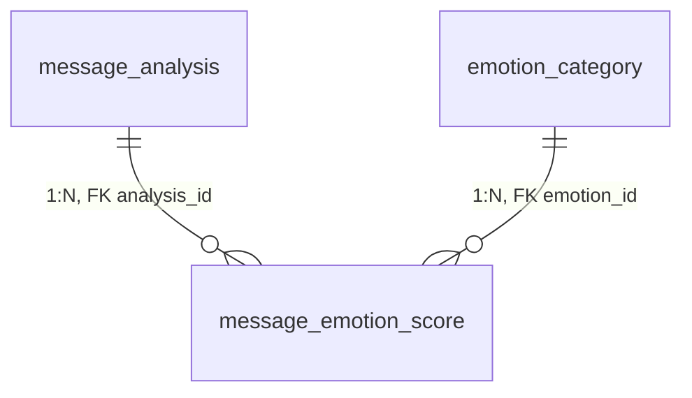
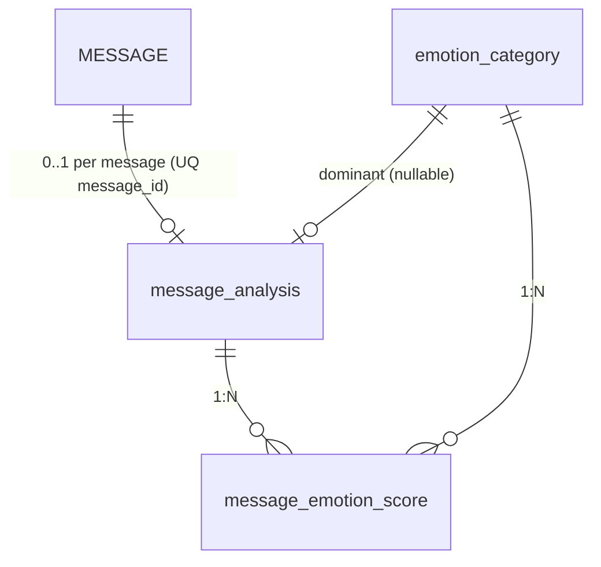

# 상담 메시지 DB 저장 (감정 분석)

## 1. 감정 카테고리 테이블

감정 종류를 하드코딩하지 않기 위한 테이블이다.

```sql
CREATE TABLE emotion_category (
    emotion_id BIGINT AUTO_INCREMENT PRIMARY KEY,
    emotion_code VARCHAR(30) NOT NULL UNIQUE,
    emotion_name VARCHAR(50) NOT NULL,
    is_active BOOLEAN DEFAULT TRUE
);
```

**예시 데이터**

| emotion_id | emotion_code | emotion_name |
|-----------:|--------------|--------------|
| 1 | ANGER | 분노 |
| 2 | SADNESS | 슬픔 |
| 3 | ANXIETY | 불안 |
| 4 | JOY | 기쁨 |
| 5 | NEUTRAL | 중립 |

---

## 2. 메시지 분석 테이블

분석 1건의 대표 결과를 저장한다.

```sql
CREATE TABLE message_analysis (
    analysis_id BIGINT AUTO_INCREMENT PRIMARY KEY,
    message_id BIGINT NOT NULL,

    dominant_emotion_id BIGINT NULL,
    risk_level TINYINT DEFAULT 0,
    is_high_risk BOOLEAN DEFAULT FALSE,

    model_name VARCHAR(100) NULL,
    model_version VARCHAR(50) NULL,

    analyzed_at TIMESTAMP DEFAULT CURRENT_TIMESTAMP,

    UNIQUE (message_id)
);
```

**의미**

| 컬럼 | 설명 |
|------|------|
| `message_id` | 분석 대상 사용자 메시지 |
| `dominant_emotion_id` | 가장 높은 감정 |
| `risk_level` | 위험도 |
| `model_name` | 분석 모델명 |
| `model_version` | 분석 모델 버전 |

---

## 3. 감정별 점수 테이블

`message_emotion_score`는 **한 건의 메시지 분석**(`message_analysis`)에 대해 **감정마다 0~1 점수를 한 행씩** 저장하는 테이블이다.  
ERD에서는 `message_analysis`와 `emotion_category`의 **1 : N** 자식 엔터티(브리지)로 둔다.

### 3.1 ERD에 쓰는 방식(요약)

| 항목 | 내용 |
|------|------|
| 엔터티 | `message_emotion_score` |
| PK | `score_id` |
| FK | `analysis_id` → `message_analysis.analysis_id` (부모: 한 분석) |
| FK | `emotion_id` → `emotion_category.emotion_id` (참조: 감정 종류) |
| 비즈니스 키 | `UNIQUE (analysis_id, emotion_id)` — 같은 분석·감정은 한 행만 |
| 카디널리티 | `message_analysis` (1) — (N) `message_emotion_score` |
| 카디널리티 | `emotion_category` (1) — (N) `message_emotion_score` |

### 3.2 DDL

```sql
CREATE TABLE message_emotion_score (
    score_id BIGINT AUTO_INCREMENT PRIMARY KEY,
    analysis_id BIGINT NOT NULL,
    emotion_id BIGINT NOT NULL,

    emotion_score DECIMAL(6,4) NOT NULL,

    created_at TIMESTAMP DEFAULT CURRENT_TIMESTAMP,

    UNIQUE (analysis_id, emotion_id)
);
```

### 3.3 Mermaid (ERD 도면용)

> 도구(Notion, GitHub, Mermaid Live 등)에 붙여 넣어 ERD로 렌더링할 수 있다.



**저장 예시**

| score_id | analysis_id | emotion_id | emotion_score |
|---------:|--------------:|------------:|--------------:|
| 1 | 10 | 1 | 0.0200 |
| 2 | 10 | 2 | 0.0020 |
| 3 | 10 | 3 | 0.6500 |
| 4 | 10 | 5 | 0.3280 |

2.0%는 `0.0200`으로 저장하는 것을 추천한다.  
즉, DB에는 **0~1 사이 소수**로 저장하고, 화면에서만 %로 변환한다.

---

## 4. 전체 관계 (1~3 + 메시지·지배 감정, ERD용)

텍스트로 쓰면 다음과 같다.

- `MESSAGE` (1) — (0..1) `message_analysis` … 메시지마다 분석이 **없을 수도** 있고, 있으면 `UNIQUE (message_id)`로 **최대 1건**
- `message_analysis` (1) — (N) `message_emotion_score`
- `emotion_category` (1) — (N) `message_emotion_score` (감정별 점수 행이 어떤 감정을 가리키는지)
- `message_analysis.dominant_emotion_id` (FK, nullable) — `emotion_category` … “지배 감정” 참조(선택)

(`MESSAGE` 테이블은 저장소의 `DB 초안.sql` 등과 동일한 `message_id` PK를 둔다고 가정한다.)

**식별자 요약**

| 엔터티(테이블) | 식별자/키 |
|----------------|-----------|
| `MESSAGE` | `message_id` (PK) |
| `message_analysis` | `analysis_id` (PK), `message_id` (UQ) |
| `message_emotion_score` | `score_id` (PK), (`analysis_id`, `emotion_id`) (UQ) |
| `emotion_category` | `emotion_id` (PK) |

**전체 Mermaid (선택)**



**관계·컬럼 요약(리스트)**

- `MESSAGE` — `message_id`
- `message_analysis` — `analysis_id`, `message_id`, `dominant_emotion_id`
- `message_emotion_score` — `score_id`, `analysis_id`, `emotion_id`, `emotion_score`
- `emotion_category` — `emotion_id`, `emotion_code`, `emotion_name`
